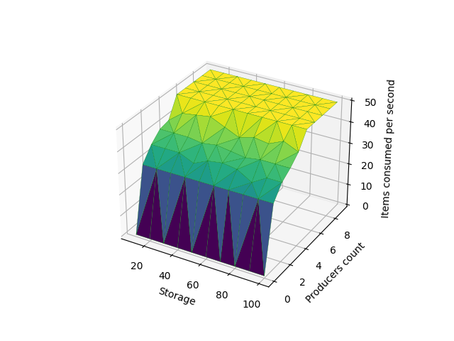
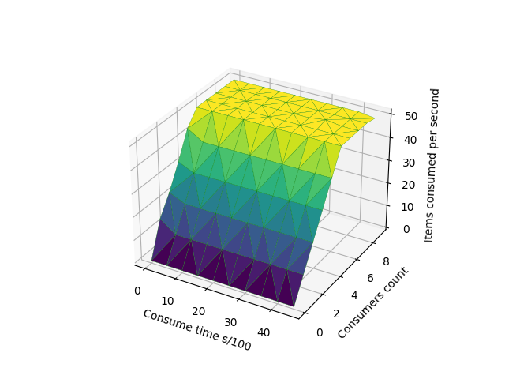

# PPDS2022
Repository for the course Parallel programming and distributed systems at FEI STU 2022.
Each exercise has its own branch. The exercises are numbered 01 - 10.
---
##The producer-consumer problem
In this lab exercise we implement an example of producer-consumer problem.
The main idea is that the producers and consumers use a shared storage space. Producers 
produce some items and put them into storage. Consumers take them from storage
and consume them. The solution is implemented using mutex when manipulating the storage
and two semaphores. One to indicate whether the storage is full. One to indicate whether
there are any stored items in storage.

Next we try finding optimal parameters to get the 
best items ***consumed*** per second.

###Experiment 1
In this experiment the storage size and producers count is variable. Consumers count
is **5** and consume time is equal to **sleep(randint(1,10) / 1000)**.We can see
that storage size doesn't impact the items consumed very much. On the other hand
the producers count does impact the result. The more producers the more items can 
be consumed per second

###Experiment 2
This experiment we change consumers and producers count. We see that the plot
has a shape similar to a ridge, getting better results where the counts are similar to each
other and worse results where they are different. It's best to keep producers and 
consumers counts in balance.

###Experiment 3
Tried making the time to consume an item variable but did not 
see an impact. There would need to be more tinkering 
with the program's running time and with the times
of different producer/consumer actions.

