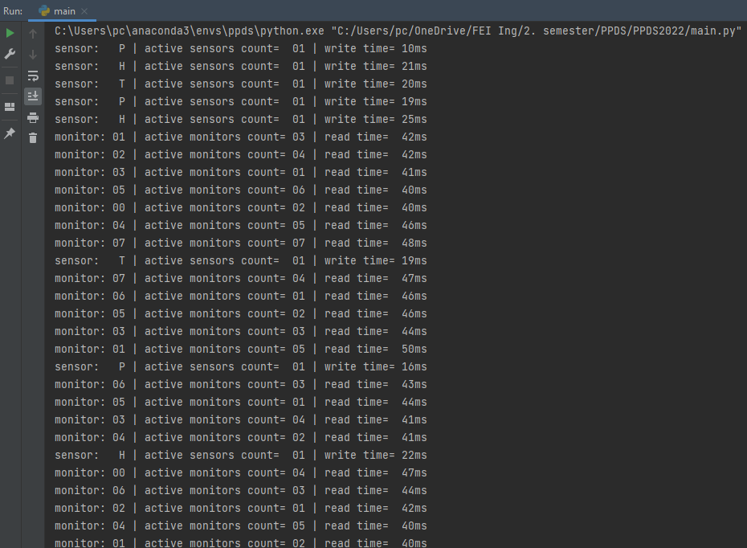

# PPDS2022
Repository for the course Parallel programming and distributed systems at FEI STU 2022.
Each exercise has its own branch. The exercises are numbered 01 - 10.
---
##Tasks
###1 Analyze what types of synchronization tasks (or their modifications or combinations) are involved in this task.
###2 Exactly map the synchronization tasks (primitives) of your choice to the individual parts of the assignment.
###3 Write the pseudocode of the problem solution.

def monitor(monitor_id):
    // Wait until sensors signal all data is ready
    valid_data.wait()

    while True:
        // Use turnstile until sensors block turnstile so they can write
        turnstile.wait()
        turnstile.signal()

        // Get accsess to data
        active_monitors_count = ls_monitor.lock(access_data)

        read_time = 40 - 50ms
        sleep(read_time)
        print('monitor {id} reading')

        // Data read, leave
        ls_monitor.unlock(access_data)

def sensor(sensor_id):
    while True:
        // Block turnstile so sensors can write
        turnstile.wait()
        // Always sleep before doing any actions
        sleep(50 - 60ms)
        // Get accsess to data
        active_sensors_count = ls_sensor.lock(access_data)

        turnstile.signal()

        write_time = 10-20ms or 20-25ms
        print('sensor {id} writing')
        sleep(write_time)
        // Signal all data ready
        valid_data.signal()

        // Data updated, leave
        ls_sensor.unlock(access_data)

def main():
    access_data = Semaphore(1)
    turnstile = Semaphore(1)
    ls_monitor = Lightswitch()
    ls_cidlo = Lightswitch()
    validData = Barrier()

    create_and_run_thread(cidlo, cidlo_P)
    create_and_run_thread(cidlo, cidlo_T)
    create_and_run_thread(cidlo, cidlo_H)
    for monitor_id in range(8):
        create_and_run_thread(monitor, monitor_id)
        

###4 Write a program that will suitably model this synchronization task.
See the code in [main.py](main.py)
###5 Listings:
Example of code output:
