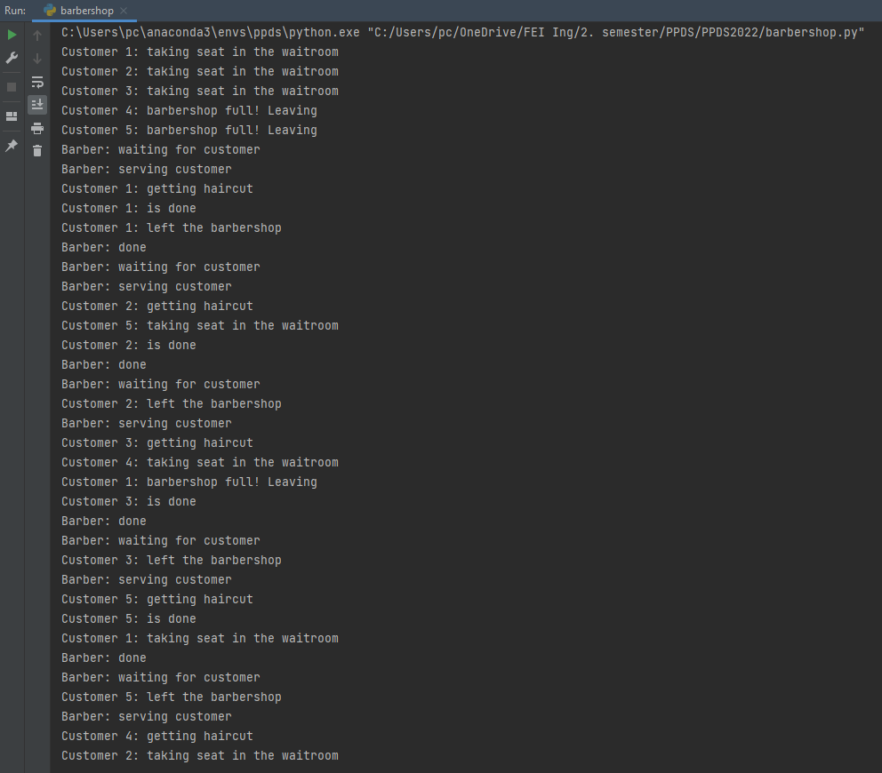

# PPDS2022
Repository for the course Parallel programming and distributed systems at FEI STU 2022.
Each exercise has its own branch. The exercises are numbered 01 - 10.

#### Branches:
- 01 - Mutex
- 02 - Simple barrier
- 03 - Producer-consumer
- 04 - Lightswitch, Monitors-sensors
- 05 - Savages
- 06 - barbershop

## Barbershop with FIFO queue

Exercise 6 of the course PPDS at FEI STU Bratislava
This exercise solves the barbershop synchronization problem.
One thread represents the barber and there is n threads
representing customers. The customers have to wait in a
waitroom for the barber to call them and give them a haircut.
We use a FIFO queue to make sure the customers get their hair
cut in the order they came to the waitroom. Find all the helpful
code comments and documentation in the file [barbershop.py](barbershop.py).

####Sample code output screenshot:

